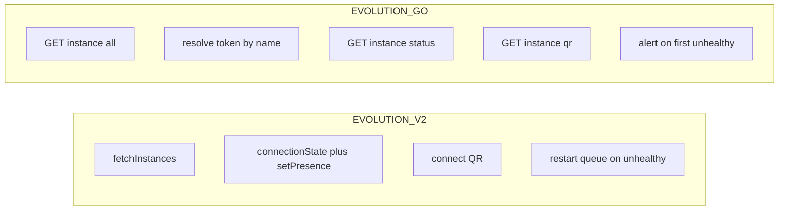

# Habilitar Evolution Go vs Evolution API v2

## Estado atual

- **Prisma** já tem `[EvolutionFlavor](packages/database/prisma/schema.prisma)` (`EVOLUTION_V2` | `EVOLUTION_GO`) em `Project`.
- **UI** (`[evolution-flavor-fields.tsx](apps/api/components/dashboard/evolution-flavor-fields.tsx)`): opção Go existe mas está `disabled` e o texto diz que só v2 é suportada.
- **Bug funcional**: `[create-project-form.tsx](apps/api/components/dashboard/create-project-form.tsx)` e `[edit-project-form.tsx](apps/api/components/dashboard/edit-project-form.tsx)` enviam **sempre** `evolutionFlavor: EVOLUTION_V2` (linhas ~53 e ~77), ignorando o radio.
- **Schema** (`[packages/shared/src/schemas/project.ts](packages/shared/src/schemas/project.ts)`): `evolutionFlavorCreateSchema` é `z.literal(EvolutionFlavor.EVOLUTION_V2)` — criar/atualizar com `EVOLUTION_GO` **falha na validação**.
- **Runtime**: `[EvolutionClient](packages/shared/src/evolution/client.ts)` só implementa rotas **Node/Evolution API v2** (`fetchInstances` → `/instance/fetchInstances`, health → `connectionState` + `setPresence`, QR → `/instance/connect/:name`, restart → `POST /instance/restart/:name`). Instanciado em `[number.service.ts](apps/api/services/number.service.ts)`, `[health-check.ts](apps/worker/src/jobs/health-check.ts)`, `[restart.ts](apps/worker/src/jobs/restart.ts)`, `[alert.ts](apps/worker/src/jobs/alert.ts)`.

## Documentação Evolution Go (fonte de verdade)

OpenAPI `[evo-go-instance.yaml](https://docs.evolutionfoundation.com.br/api-reference/openapi/Evolution-Go/evo-go-instance.yaml)`: há `GET /instance/all`, `GET /instance/qr`, `GET /instance/status`, `POST /instance/connect`, etc. **Não há** `POST /instance/restart/:instanceName` neste bundle.

Os GET `/instance/qr` e `/instance/status` **não documentam** query/path para nome da instância; a doc descreve `apikey` **global ou por instância**. Plano operacional coerente com o modelo atual (uma API key por projeto + vários `Number.instanceName`):

1. Com a **API key global** do projeto, chamar `GET /instance/all`.
2. Localizar o item cujo campo `name` coincide com `number.instanceName` e usar o campo `token` da instância como `**apikey` nas chamadas** a `/instance/status` e `/instance/qr` (e para fluxos que exigirem escopo da instância).
3. Parsing **defensivo** de JSON (`data` array vs `instances`, chaves `Connected`/`LoggedIn` vs aninhamento), como já previsto na skill.

## Política Evolution Go: sem restart, alerta na primeira falha

A API Evolution Go **não oferece** restart equivalente ao v2. Em vez de simular restart (logout/connect) ou acumular falhas antes de notificar:

- No worker `[health-check.ts](apps/worker/src/jobs/health-check.ts)`, quando `project.evolutionFlavor === EVOLUTION_GO` e `checkHealth` falhar (instância desconectada / unhealthy), **enfileirar o fluxo de alerta na primeira vez** — o mesmo caminho usado hoje quando se decide alertar (job `alert` com `errorType`, atualização de estado do `Number`).
- **Não** enfileirar jobs na fila `restart` para projetos Go.
- **Não** exigir `FAILURES_BEFORE_RESTART`, nem o ciclo `restartAttempts` / `maxRetries` / `computeDelayMs` para decidir o alerta (comportamento atual do v2).
- `AUTH_ERROR` e `INSTANCE_NOT_FOUND` continuam com alerta imediato como hoje; para Go, o mesmo “alerta já na primeira falha” cobre também falhas genéricas de desconexão.

Restart manual na UI (se existir) para números Go deve **no-op** ou retornar erro amigável — detalhar na implementação para não enfileirar job inútil.

## Implementação proposta

### 1) Validação e API de projeto

- Em `[project.ts` (schemas)](packages/shared/src/schemas/project.ts): trocar `evolutionFlavorCreateSchema` para aceitar **ambos** os valores, p.ex. `z.nativeEnum(EvolutionFlavor)` (ou `z.enum([...])`), para `createProjectSchema` e `updateProjectSchema`.

### 2) Formulários e UI

- `[evolution-flavor-fields.tsx](apps/api/components/dashboard/evolution-flavor-fields.tsx)`: remover `disabled`/`opacity` da opção Go; atualizar textos de ajuda (PT/EN) indicando que Go usa os endpoints documentados e que alertas disparam na primeira falha de conexão (sem ciclo de restart).
- `[create-project-form.tsx](apps/api/components/dashboard/create-project-form.tsx)`: estado `evolutionFlavor` (default `EVOLUTION_V2`) + `EvolutionFlavorFields` controlado (`value` + `onChange`) **ou** `FormData` no submit lendo `name="evolution-flavor-create"` — deixar de hardcodar `EVOLUTION_V2`.
- `[edit-project-form.tsx](apps/api/components/dashboard/edit-project-form.tsx)`: idem — enviar o sabor selecionado, não constante `EVOLUTION_V2`.

### 3) `EvolutionClient` com flavor

- Estender o construtor com `flavor: EvolutionFlavor` (default `EVOLUTION_V2` para não quebrar chamadas existentes).
- **V2**: manter implementação atual inalterada (inclui `restart`).
- **Go**:
  - **fetchInstances**: `GET /instance/all`; normalizar resposta para que `[parseInstanceNames](apps/api/services/number.service.ts)` continue funcionando — estender `parseInstanceNames` para aceitar `data` como array de objetos com `name` (e manter `instance`, `instances` como hoje).
  - **checkHealth**: (1) resolver `token` via `/instance/all` + match `name` === `instanceName`; (2) `GET /instance/status` com header `apikey: <token>`; (3) considerar saudável quando `Connected` e `LoggedIn` forem verdadeiros no payload (normalizar chaves/caso); mapear falhas a `ErrorType` como no cliente v2.
  - **getConnect**: `GET /instance/qr` com `apikey` da instância; extrair QR de `data.Qrcode` (data URI → base64 se necessário para alertas) e pairing de `data.Code`.
  - **Não implementar `restart`** para Go no cliente (método pode lançar erro claro ou ser inalcançável porque o health-check não enfileira restart para Go).

### 4) Passar `evolutionFlavor` do projeto para o cliente

- Onde hoje se faz `new EvolutionClient(project.evolutionUrl, apiKey, timeouts)`, passar também `project.evolutionFlavor` (incluir `evolutionFlavor` nos `include`/`select` do Prisma se algum caminho não carregar o campo).

### 5) Documentação interna

- Atualizar `[.cursor/skills/evolution-api-integration/SKILL.md](.cursor/skills/evolution-api-integration/SKILL.md)` (e se útil `[.cursor/rules/009-evolution-api.mdc](.cursor/rules/009-evolution-api.mdc)`) com: resolução `token` via `/instance/all`, health via `/instance/status`, QR via `/instance/qr`, **ausência de restart na API Go**, e **política do monitor**: primeira falha de saúde → alerta (sem ciclo de restart).

### 6) Testes

- Testes unitários em `packages/shared` para: parsing de `/instance/all` e de `/instance/status`; branch v2 inalterada.
- Cobertura no worker: ramo Go em `health-check` enfileira `alert` na primeira falha e **não** enfileira `restart`.

