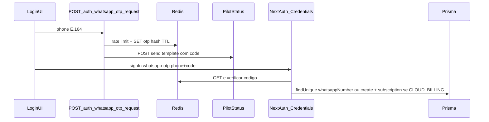

# Login via OTP (WhatsApp / Pilot Status)

## Contexto no repositório

- **NextAuth** hoje só usa Google/GitHub em `[apps/api/lib/auth.ts](apps/api/lib/auth.ts)`; `signIn` rejeita qualquer provider que não seja esses dois — será preciso **permitir o novo provider** e ajustar `jwt`/`session` para usuários sem e-mail.
- O modelo **User** já tem `whatsappNumber String? @unique` (`[packages/database/prisma/schema.prisma](packages/database/prisma/schema.prisma)`), adequado para identificar quem entra por WhatsApp.
- **Pilot Status** já está integrado no worker com `PilotStatusClient` + `MONITOR_STATUS_API_KEY` + `templateId` + variáveis (`[apps/worker/src/jobs/alert.ts](apps/worker/src/jobs/alert.ts)`). A app **api** já depende de `@pilot-status/sdk` (`[apps/api/package.json](apps/api/package.json)`).
- **Redis** na API: `[apps/api/lib/redis.ts](apps/api/lib/redis.ts)` — usar para OTP + rate limit (padrão alinhado a webhooks Stripe/Pague.dev).

## Fluxo proposto

1. Utilizador introduz número em **E.164** (mesmo tipo de validação usado para alertas, ex. `+5511999999999`).
2. **POST** gera OTP (ex. 6 dígitos), guarda no Redis (valor **hasheado** com `crypto.scrypt` ou HMAC com segredo derivado de `NEXTAUTH_SECRET` — evitar guardar código em claro), TTL curto (ex. 5–10 min).
3. Envio via **Pilot Status** `messages.send` com `**templateId: otp_login_evo_api_manager`** e variável(ões) do template (ex. `code` — alinhar ao que o template aprovado no Pilot Status espera).
4. Utilizador submete código → `**signIn('whatsapp-otp', { phone, code, redirect: false })**` com **Credentials provider** no NextAuth; `authorize` valida Redis, resolve/cria `User` por `whatsappNumber`, devolve `{ id, name, email: null }`.
5. Callbacks `jwt` / `session`: garantir `session.user.id` = `User.id` via `token.sub` (o callback atual já tenta `token.sub` quando não há e-mail — validar e corrigir se necessário).

## Configuração (env)

- Reutilizar `**MONITOR_STATUS_API_KEY`** (e opcionalmente `MONITOR_STATUS_BASE_URL` se o SDK suportar, como no resto do projeto).
- `**templateId` fixo para OTP**: `**otp_login_evo_api_manager`** (template já definido no Pilot Status para este produto). Opcionalmente expor `**AUTH_OTP_TEMPLATE_ID**` no env com default `otp_login_evo_api_manager` para overrides em staging sem alterar código.
- **Registar provider** quando `MONITOR_STATUS_API_KEY` estiver definido e o env de OTP estiver “ligado” (chave presente + template resolvido — se só usarmos default, basta a chave).
- Estender validação em `[packages/shared/src/env.ts](packages/shared/src/env.ts)`: quando login OTP estiver disponível (`MONITOR_STATUS_API_KEY` + template), exigir `**NEXTAUTH_URL`** (mesma regra já usada para OAuth).

Documentar em `[.env.example](.env.example)` e, se aplicável, em `[docker-compose.dev.yml](docker-compose.dev.yml)`.

## Camadas (regras do projeto)

- **Route handlers finos** + lógica em **service/lib**:
  - Novo serviço, por exemplo `[apps/api/lib/services/whatsapp-otp-auth.service.ts](apps/api/lib/services/whatsapp-otp-auth.service.ts)` (ou `apps/api/services/…` se for o padrão predominante da app): normalizar telefone, rate limit, gerar/validar OTP, chamar Pilot Status com `templateId: 'otp_login_evo_api_manager'`, logs **JSON estruturados** (não `console.log` solto).
  - **POST** `[apps/api/app/api/auth/whatsapp-otp/request/route.ts](apps/api/app/api/auth/whatsapp-otp/request/route.ts)`: sem sessão; validação Zod (schemas em `[packages/shared/src/schemas/auth.ts](packages/shared/src/schemas/auth.ts)`).

## Segurança e UX

- **Rate limit**: por número (ex. máx. N pedidos/hora) + cooldown entre envios (ex. 60s) — chaves Redis dedicadas.
- **Respostas genéricas** no pedido de OTP (evitar enumerar contas), ou mensagem neutra tipo “Se o número for válido, enviámos um código”.
- **TEST vs LIVE** Pilot Status: em TEST o envio só vai para o WhatsApp do perfil — documentar para quem desenvolve localmente.
- **i18n**: textos na UI com o mesmo padrão de `[apps/api/app/(auth)/login/login-page-body.tsx](apps/api/app/(auth)`/login/login-page-body.tsx) (`useT`).

## UI

- Em `[login-page-body.tsx](apps/api/app/(auth)`/login/login-page-body.tsx): secção opcional “Entrar com WhatsApp” quando o provider existir (pode usar `getProviders()` de `next-auth/react` no mount ou prop do servidor).
- Dois passos: input telefone + botão “Enviar código”; depois input OTP + “Entrar”; estados de loading e erro.

## Escopo explícito (não incluído neste plano)

- **Ligar** o mesmo número a uma conta que já tem só Google/GitHub (account linking) — exigiria fluxo e modelo adicional.
- Webhook Pilot Status específico para OTP — não necessário para autenticar; só envio.

## Ficheiros principais a tocar

| Área         | Ficheiros                                                                                                                                |
| ------------ | ---------------------------------------------------------------------------------------------------------------------------------------- |
| Env / schema | `[packages/shared/src/env.ts](packages/shared/src/env.ts)`, `[packages/shared/src/schemas/auth.ts](packages/shared/src/schemas/auth.ts)` |
| Auth         | `[apps/api/lib/auth.ts](apps/api/lib/auth.ts)`                                                                                           |
| OTP + Pilot  | Novo service + rota `request`                                                                                                            |
| UI           | `[apps/api/app/(auth)/login/login-page-body.tsx](apps/api/app/(auth)`/login/login-page-body.tsx)                                         |
| Docs env     | `[.env.example](.env.example)`                                                                                                           |

## Pré-requisito operacional

Template `**otp_login_evo_api_manager`** aprovado no **Pilot Status** com variáveis compatíveis com o código (ex. `code` para o OTP). Override opcional via `AUTH_OTP_TEMPLATE_ID` se necessário.