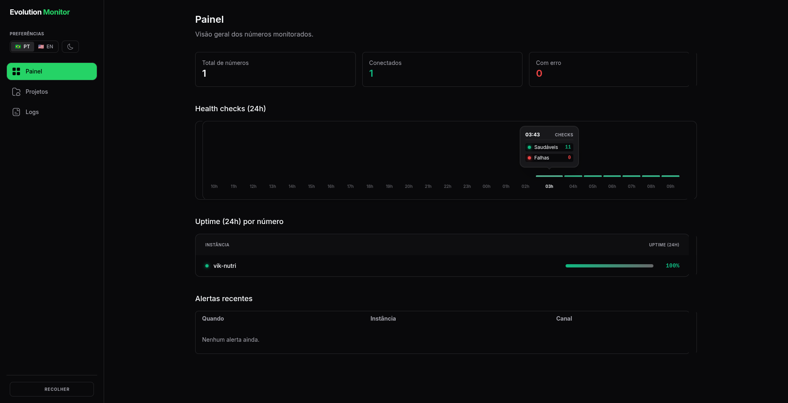
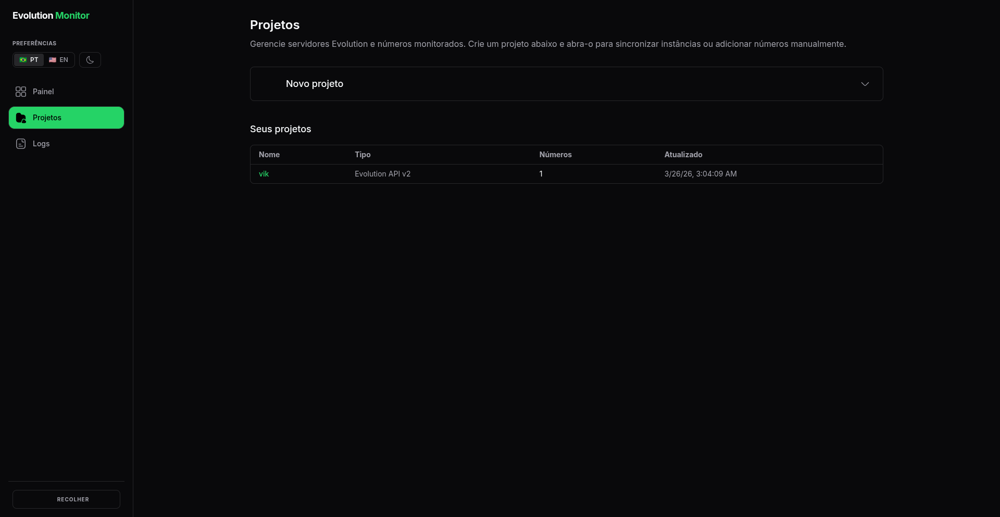
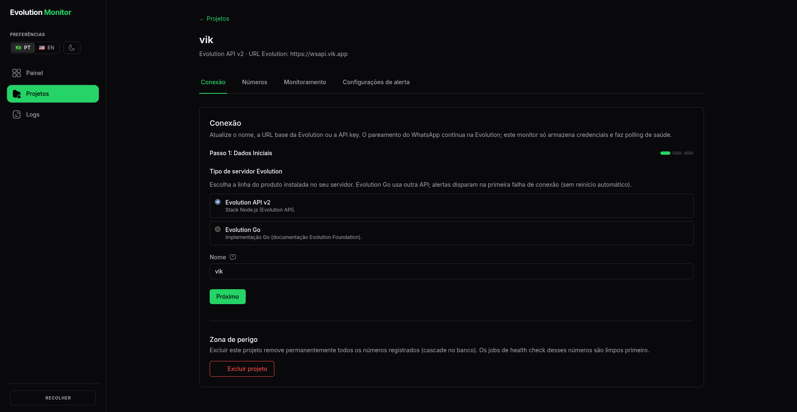
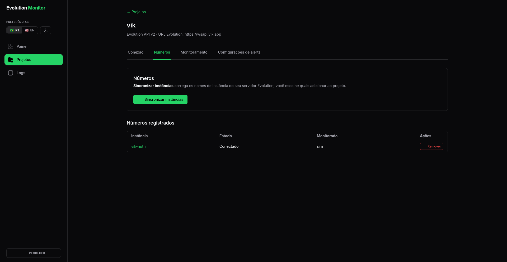
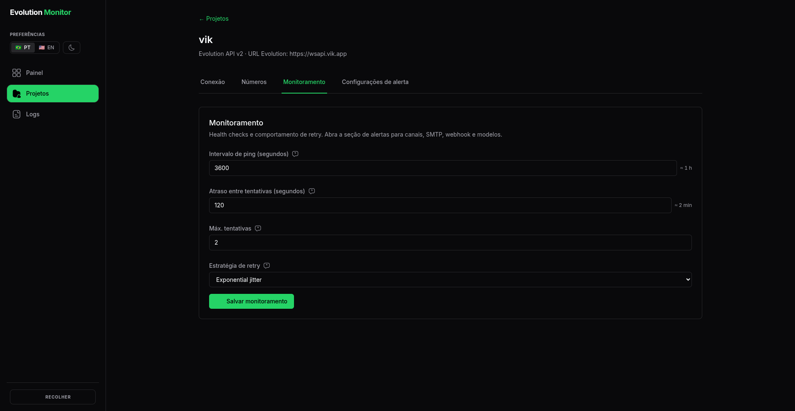
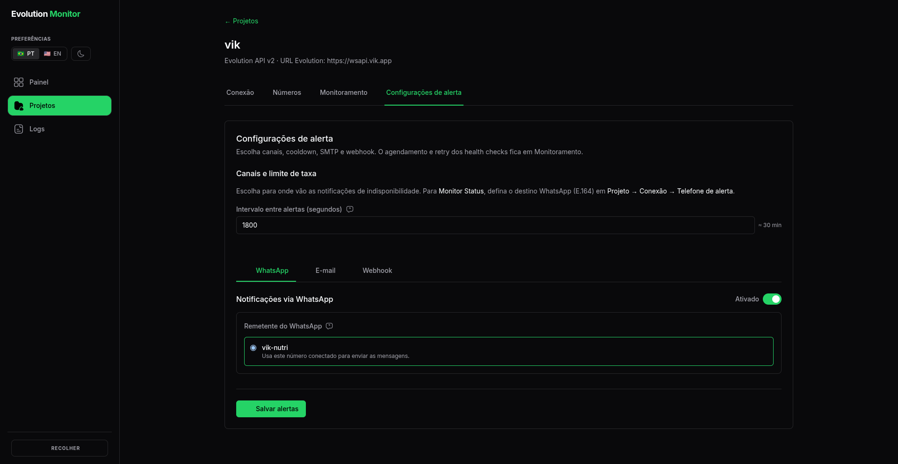
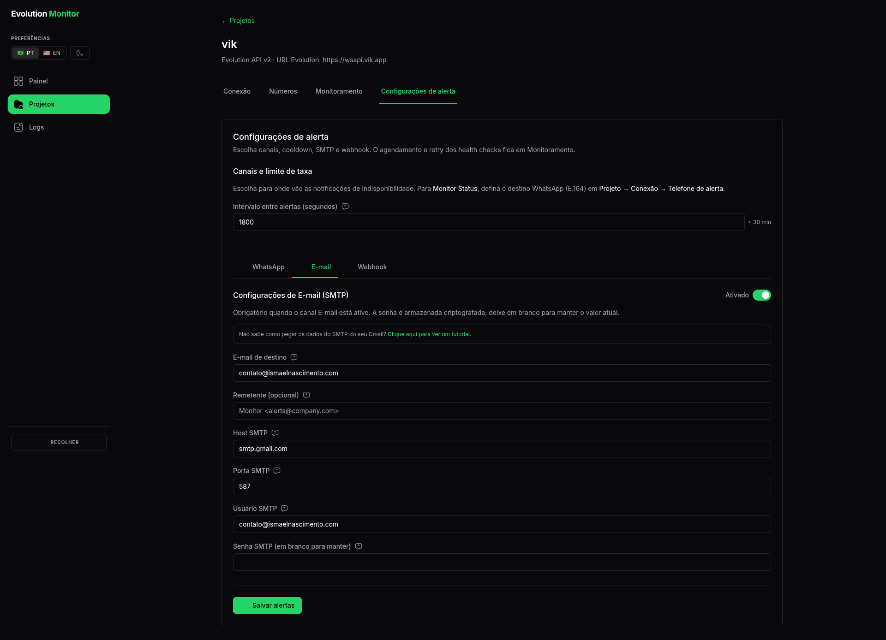
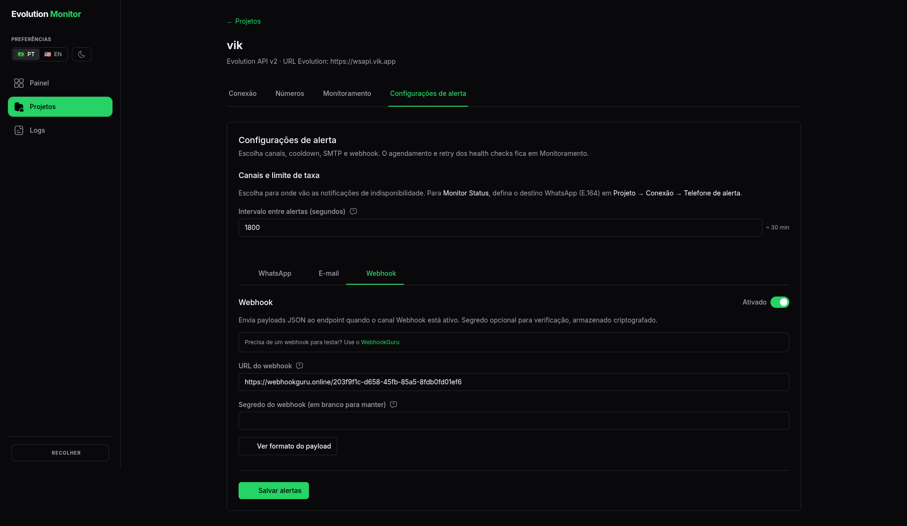

# Evolution API Monitor (OSS)

An open-source dashboard and background worker to monitor, manage, and track health checks for your Evolution API instances. This repository provides a clean, fast, and secure interface to keep an eye on all your connected numbers, instances, and configurations without any proprietary billing or authentication logic.

## ☁️ Cloud Version (Fully Managed)

Looking for a hassle-free setup? Check out our **[Evolution API Monitor Cloud](https://evolutionapi.online)**! It is a fully managed solution that saves you manual installation time and conserves your VPS resources, so you can focus entirely on managing your instances.

## 🚀 Features

- **Dashboard:** Clean, responsive UI to manage multiple Evolution API instances.
- **Real-Time Health Checks:** Automated background workers (BullMQ + Redis) that periodically ping your instances.
- **Uptime Monitoring:** Visual charts for 24h, 7-day, and 30-day uptime.
- **Instance Synchronization:** Fetch and sync numbers directly from your Evolution API servers.
- **Alerts:** Get notified (via Webhook, Email, etc.) when instances go offline.
- **Multi-Project Management:** Group instances logically into different projects.

## 📸 Screenshots



















## 📋 Prerequisites

Make sure you have the following installed on your machine:
- [Node.js](https://nodejs.org/en/) (v20 or higher)
- [Docker](https://www.docker.com/) & [Docker Compose](https://docs.docker.com/compose/)
- [Git](https://git-scm.com/)

---

## 🐳 Quick Start (Localhost with Docker Compose - Recommended)

The easiest way to get the project running locally is by using Docker Compose. This will automatically spin up PostgreSQL, Redis, the Web Dashboard (Next.js), and the Background Worker.

1. **Clone the repository:**
   ```bash
   git clone https://github.com/oismaelash/evolution-api-monitor-oss.git
   cd evolution-api-monitor-oss
   ```

2. **Configure Environment Variables:**
   ```bash
   cp .env.example .env
   ```
   *Note: The default `.env.example` is already pre-configured to work with the local docker-compose setup.*

3. **Start the Development Environment:**
   ```bash
   npm run dev:docker
   # Or manually: docker compose -f docker-compose.dev.yml up -d --build
   ```

4. **Access the Dashboard:**
   Open your browser and navigate to [http://localhost:3000](http://localhost:3000).

---

## 🔐 Dashboard access password (self-hosted OSS)

The OSS build protects the dashboard and internal APIs with an **access lock** (cookie-based session after you authenticate). This is separate from Evolution API keys: it only controls who can open the monitor UI and call `/api/*` from the browser.

### How it works

- **Lock enabled by default:** unless you set `APP_ACCESS_LOCK=false`, visitors must unlock the app first.
- **Signing secret (required when the lock is on):** set a stable **`ENCRYPTION_KEY`** (64 hex characters, see `.env.example`) or **`NEXTAUTH_SECRET`** (at least 32 characters) in the environment. Without one of these, the app shows a configuration message on `/access` instead of a working login.
- **Two ways to set the password:**
  1. **`OSS_ACCESS_PASSWORD` in `.env`:** if set, you always see a single “enter password” screen. Type the **same value** as in the environment variable. Nothing is stored in the database for this mode; the value never belongs in git—only in your server or secrets manager.
  2. **No `OSS_ACCESS_PASSWORD`:** on the **first** visit you choose a password in the UI (minimum 8 characters); it is stored as a **hash** in the database for the built-in OSS user. On later visits you enter that password to get a session cookie.

If both an env password and a database password exist, **the environment password takes precedence** for unlocking.

### Disabling the lock

Set **`APP_ACCESS_LOCK=false`** in `.env` (for example in CI, or when you later use full cloud auth). Then the middleware no longer enforces the gate.

### Operational notes

- Session cookies are **httpOnly** and last **7 days**; closing the browser does not clear them until they expire or you clear site data.
- There is no “forgot password” flow in OSS: for env mode, change `OSS_ACCESS_PASSWORD` or `APP_ACCESS_LOCK`; for UI mode, reset the user’s `passwordHash` in the database or switch to env-based password.
- See **`.env.example`** for `APP_ACCESS_LOCK`, `OSS_ACCESS_PASSWORD`, and encryption-related variables.

---

## 💻 Local Development Setup (Manual)

If you prefer to run the Next.js app and the Worker directly on your host machine (for better debugging or IDE integration):

1. **Install Dependencies:**
   ```bash
   npm install
   ```

2. **Setup Environment Variables:**
   ```bash
   cp .env.example .env
   ```

3. **Start the Infrastructure (PostgreSQL & Redis):**
   You can use docker-compose to start just the databases.
   ```bash
   docker compose -f docker-compose.dev.yml up -d db redis
   ```

4. **Run Database Migrations:**
   ```bash
   npm run db:migrate
   ```

5. **Start the Application:**
   Open two terminal tabs.
   
   **Terminal 1 (Web API):**
   ```bash
   npm run dev
   ```
   
   **Terminal 2 (Background Worker):**
   ```bash
   npm run dev:worker
   ```

The app will be available at `http://localhost:3000`.

---

## 🚢 Production Deployment

For production, you should use the `docker-compose.prod.yml` file. This setup optimizes the Next.js build and runs the worker in production mode.

1. Configure your `.env` file with secure, production-ready values (ensure you change the `ENCRYPTION_KEY` by running `openssl rand -hex 32`). Keep **`ENCRYPTION_KEY`** stable across restarts if you use the dashboard access lock (see **Dashboard access password (self-hosted OSS)** above). Optionally set **`OSS_ACCESS_PASSWORD`** or rely on the first-time UI password flow.

2. Build and start the containers:
   ```bash
   docker compose -f docker-compose.prod.yml up -d --build
   ```

3. Run migrations inside the production container (only required on the first setup or after updates):
   ```bash
   docker compose -f docker-compose.prod.yml exec api npm run db:migrate:deploy
   ```

---

## 🤝 How to Contribute

We welcome contributions from the community! If you'd like to improve the Evolution API Monitor, please follow these steps:

1. **Fork the repository** on GitHub.
2. **Clone your fork locally:**
   ```bash
   git clone https://github.com/YOUR_USERNAME/evolution-api-monitor-oss.git
   ```
3. **Create a new branch** for your feature or bug fix:
   ```bash
   git checkout -b feature/my-new-feature
   ```
4. **Make your changes** and commit them using conventional commits:
   ```bash
   git commit -m "feat: add new uptime metric"
   ```
5. **Push your branch** to your fork:
   ```bash
   git push origin feature/my-new-feature
   ```
6. **Open a Pull Request** against the `main` branch of this repository.

### Coding Standards
- The project is a monorepo built with npm workspaces.
- We use **TypeScript** and **Next.js (App Router)**.
- Please run `npm run lint` and `npm run test` before submitting your PR to ensure everything is working correctly.

## 📄 License

This project is licensed under the MIT License - see the LICENSE file for details.
